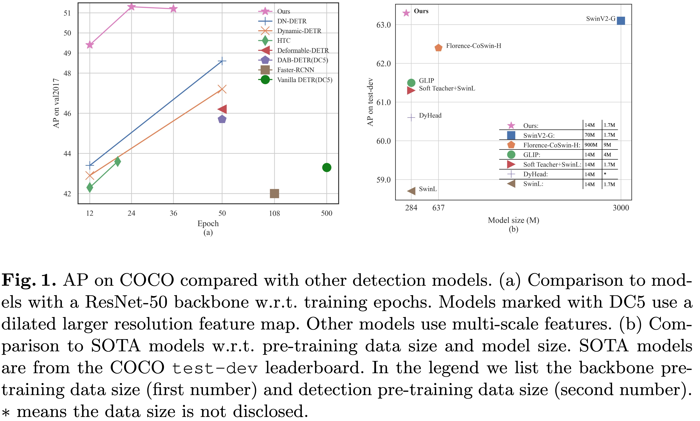
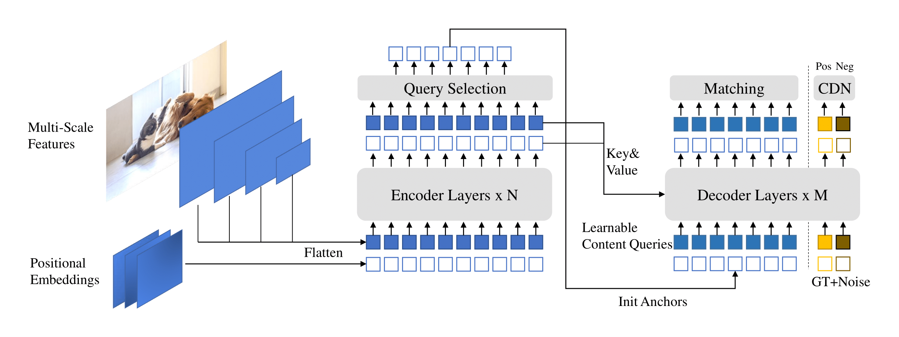

# DINO 
[](https://paperswithcode.com/sota/object-detection-on-coco-minival?p=dino-detr-with-improved-denoising-anchor-1)
[](https://paperswithcode.com/sota/object-detection-on-coco?p=dino-detr-with-improved-denoising-anchor-1)

This is the official implementation of the paper "[DINO: DETR with Improved DeNoising Anchor Boxes for End-to-End Object Detection](https://arxiv.org/abs/2203.03605)". 
(DINO pronounced `daɪnoʊ' as in dinosaur)

Authors: [Hao Zhang](https://scholar.google.com/citations?user=B8hPxMQAAAAJ&hl=zh-CN)\*, [Feng Li](https://fengli-ust.github.io/)\*, [Shilong Liu](https://www.lsl.zone/)\*, [Lei Zhang](https://www.leizhang.org/), [Hang Su](https://www.suhangss.me/), [Jun Zhu](https://ml.cs.tsinghua.edu.cn/~jun/index.shtml), [Lionel M. Ni](https://www.cse.ust.hk/~ni/), [Heung-Yeung Shum](https://scholar.google.com.hk/citations?user=9akH-n8AAAAJ&hl=en)

# News
[2022/8/6]: We update Swin-L model results without techniques such as O365 pre-training, large image size, and multi-scale test. We also upload the corresponding checkpoints to [Google Drive.](https://drive.google.com/drive/folders/1qD5m1NmK0kjE5hh-G17XUX751WsEG-h_?usp=sharing) Our 5-scale model without any tricks obtains 58.5 AP on COCO val.</br>
[2022/7/14]: We release the code with Swin-L and Convnext backbone. </br> 
[2022/7/10]: We release the code and checkpoints with Resnet-50 backbone. </br>
[2022/6/7]: We release a unified detection and segmentation model [Mask DINO](https://arxiv.org/pdf/2206.02777.pdf) that achieves the best results on all the three segmentation tasks (**54.7** AP on [COCO instance leaderboard](https://paperswithcode.com/sota/instance-segmentation-on-coco), **59.5** PQ on [COCO panoptic leaderboard](https://paperswithcode.com/sota/panoptic-segmentation-on-coco-test-dev), and **60.8** mIoU on [ADE20K semantic leaderboard](https://paperswithcode.com/sota/semantic-segmentation-on-ade20k))! Code will be available [here](https://github.com/IDEACVR/MaskDINO).
</br>
[2022/5/28] Code for [DN-DETR](https://arxiv.org/pdf/2203.01305.pdf) is available [here](https://github.com/IDEA-opensource/DN-DETR).
</br>
[2020/4/10]: Code for [DAB-DETR](https://arxiv.org/abs/2201.12329) is avaliable [here](https://github.com/SlongLiu/DAB-DETR).
</br>
[2022/3/8]: We reach the SOTA on [MS-COCO leader board](https://paperswithcode.com/sota/object-detection-on-coco) with **63.3AP**!
</br>
[2022/3/9]: We build a repo [Awesome Detection Transformer](https://github.com/IDEACVR/awesome-detection-transformer) to present papers about transformer for detection and segmenttion. Welcome to your attention!


# Introduction
We present **DINO** (**D**ETR with **I**mproved de**N**oising anch**O**r
boxes) with:

1. **State-of-the-art & end-to-end**: DINO achieves **63.2** AP on COCO Val and **63.3** AP on COCO test-dev with more than ten times smaller model size and data size than previous best models.
2. **Fast-converging**: With the ResNet-50 backbone, DINO with 5 scales achieves  **49.4** AP in 12 epochs and **51.3** AP in 24 epochs. Our 4-scale model achieves similar performance and runs at 23 FPS.


# Methods



## Model Zoo
We have put our model checkpoints here [[model zoo in Google Drive]](https://drive.google.com/drive/folders/1qD5m1NmK0kjE5hh-G17XUX751WsEG-h_?usp=sharing)[[model zoo in 百度网盘]](https://pan.baidu.com/s/1St5rvfgfPwpnPuf_Oe6DpQ)（提取码"DINO"), where checkpoint{x}_{y}scale.pth denotes the checkpoint of y-scale model trained for x epochs. 

### 12 epoch setting
<table>
  <thead>
    <tr style="text-align: right;">
      <th></th>
      <th>name</th>
      <th>backbone</th>
      <th>box AP</th>
      <th>Checkpoint</th>
      <th>Where in <a href="https://arxiv.org/abs/2203.03605">Our Paper</a></th>
    </tr>
  </thead>
  <tbody>
    <tr>
      <th>1</th>
      <td>DINO-4scale</td>
      <td>R50</td>
      <td>49.0</td>
      <td><a href="https://drive.google.com/drive/folders/1qD5m1NmK0kjE5hh-G17XUX751WsEG-h_?usp=sharing">Google Drive</a>&nbsp/&nbsp<a href="https://pan.baidu.com/s/1St5rvfgfPwpnPuf_Oe6DpQ">BaiDu</a>&nbsp</td>
      <td>Table 1</td>
    </tr>
    <tr>
      <th>2</th>
      <td>DINO-5scale</td>
      <td>R50</td>
      <td>49.4</td>
      <td><a href="https://drive.google.com/drive/folders/1qD5m1NmK0kjE5hh-G17XUX751WsEG-h_?usp=sharing">Google Drive</a>&nbsp/&nbsp<a href="https://pan.baidu.com/s/1St5rvfgfPwpnPuf_Oe6DpQ">BaiDu</a>&nbsp;</td>
      <td>Table 1</td>
    </tr>
    <tr>
      <th>3</th>
      <td>DINO-4scale</td>
      <td>Swin-L</td>
      <td>56.8</td>
      <td><a href="https://drive.google.com/drive/folders/1qD5m1NmK0kjE5hh-G17XUX751WsEG-h_?usp=sharing">Google Drive</a>&nbsp</td>
      <td></td>
    </tr>
    <tr>
      <th>4</th>
      <td>DINO-5scale</td>
      <td>Swin-L</td>
      <td>57.3</td>
      <td><a href="https://drive.google.com/drive/folders/1qD5m1NmK0kjE5hh-G17XUX751WsEG-h_?usp=sharing">Google Drive</a>&nbsp</td>
      <td></td>
    </tr>
  </tbody>
</table>

### 24 epoch setting
<table>
  <thead>
    <tr style="text-align: right;">
      <th></th>
      <th>name</th>
      <th>backbone</th>
      <th>box AP</th>
      <th>Checkpoint</th>
      <th>Where in <a href="https://arxiv.org/abs/2203.03605">Our Paper</a></th>
    </tr>
  </thead>
  <tbody>
    <tr>
      <th>1</th>
      <td>DINO-4scale</td>
      <td>R50</td>
      <td>50.4</td>
      <td><a href="https://drive.google.com/drive/folders/1qD5m1NmK0kjE5hh-G17XUX751WsEG-h_?usp=sharing">Google Drive</a>&nbsp/&nbsp<a href="https://pan.baidu.com/s/1St5rvfgfPwpnPuf_Oe6DpQ">BaiDu</a>&nbsp</td>
      <td>Table 2</td>
    </tr>
    <tr>
      <th>2</th>
      <td>DINO-5scale</td>
      <td>R50</td>
      <td>51.3</td>
      <td><a href="https://drive.google.com/drive/folders/1qD5m1NmK0kjE5hh-G17XUX751WsEG-h_?usp=sharing">Google Drive</a>&nbsp/&nbsp<a href="https://pan.baidu.com/s/1St5rvfgfPwpnPuf_Oe6DpQ">BaiDu</a>&nbsp;</td>
      <td>Table 2</td>
    </tr>
  </tbody>
</table>

### 36 epoch setting
<table>
  <thead>
    <tr style="text-align: right;">
      <th></th>
      <th>name</th>
      <th>backbone</th>
      <th>box AP</th>
      <th>Checkpoint</th>
      <th>Where in <a href="https://arxiv.org/abs/2203.03605">Our Paper</a></th>
    </tr>
  </thead>
  <tbody>
    <tr>
      <th>1</th>
      <td>DINO-4scale</td>
      <td>R50</td>
      <td>50.9</td>
      <td><a href="https://drive.google.com/drive/folders/1qD5m1NmK0kjE5hh-G17XUX751WsEG-h_?usp=sharing">Google Drive</a>&nbsp/&nbsp<a href="https://pan.baidu.com/s/1St5rvfgfPwpnPuf_Oe6DpQ">BaiDu</a>&nbsp</td>
      <td>Table 2</td>
    </tr>
    <tr>
      <th>2</th>
      <td>DINO-5scale</td>
      <td>R50</td>
      <td>51.2</td>
      <td><a href="https://drive.google.com/drive/folders/1qD5m1NmK0kjE5hh-G17XUX751WsEG-h_?usp=sharing">Google Drive</a>&nbsp/&nbsp<a href="https://pan.baidu.com/s/1St5rvfgfPwpnPuf_Oe6DpQ">BaiDu</a>&nbsp;</td>
      <td>Table 2</td>
    </tr>
    <tr>
      <th>3</th>
      <td>DINO-4scale</td>
      <td>Swin-L</td>
      <td>58.0</td>
      <td><a href="https://drive.google.com/drive/folders/1qD5m1NmK0kjE5hh-G17XUX751WsEG-h_?usp=sharing">Google Drive</a>&nbsp</td>
      <td></td>
    </tr>
    <tr>
      <th>4</th>
      <td>DINO-5scale</td>
      <td>Swin-L</td>
      <td>58.5</td>
      <td><a href="https://drive.google.com/drive/folders/1qD5m1NmK0kjE5hh-G17XUX751WsEG-h_?usp=sharing">Google Drive</a>&nbsp</td>
      <td></td>
    </tr>
  </tbody>
</table>

## Installation
We use the environment same to DAB-DETR and DN-DETR to run DINO. If you have run DN-DETR or DAB-DETR, you can skip this step.
We test our models under ```python=3.7.3,pytorch=1.9.0,cuda=11.1```. Other versions might be available as well.

1. Clone this repo
```sh
git https://github.com/IDEACVR/DINO
cd DINO
```

2. Install Pytorch and torchvision

Follow the instruction on https://pytorch.org/get-started/locally/.
```sh
# an example:
conda install -c pytorch pytorch torchvision
```

3. Install other needed packages
```sh
pip install -r requirements.txt
```

4. Compiling CUDA operators
```sh
cd models/dino/ops
python setup.py build install
# unit test (should see all checking is True)
python test.py
cd ../../..
```

## Data
Please download [COCO 2017](https://cocodataset.org/) dataset and organize them as following:
```
COCODIR/
  ├── train2017/
  ├── val2017/
  └── annotations/
  	├── instances_train2017.json
  	└── instances_val2017.json
```


## Run
We use DINO 4-scale model trained for 12 epochs as an example to demonstrate how to evaluate and train our model.

### Eval our pretrianed model
Download our DINO model checkpoint "checkpoint0011_4scale.pth" from [this link](https://drive.google.com/drive/folders/1qD5m1NmK0kjE5hh-G17XUX751WsEG-h_?usp=sharing) and perform the command below. You can expect to get the final AP about 49.0.
```sh
bash scripts/DINO_eval.sh /path/to/your/COCODIR /path/to/your/checkpoint
```
### Inference and Visualizations
For inference and visualizations, we provide a [notebook](inference_and_visualization.ipynb) as an example.

### Train the 4scale model for 12 epochs
You can also train our model on a single process:
```sh
bash scripts/DINO_train.sh /path/to/your/COCODIR
```
### Distributed Run
However, as the training is time consuming, we suggest to train the model on multi-device.

If you plan to train the models on a cluster with Slurm, here is an example command for training:
```sh
# for DINO-4scale: 49.0
bash scripts/DINO_train_submitit.sh /path/to/your/COCODIR

# for DINO-5scale: 49.4
bash scripts/DINO_train_submitit_5scale.sh /path/to/your/COCODIR
```
Notes:
The results are sensitive to the batch size. We use 16(2 images each GPU x 8 GPUs for DINO-4scale and 1 images each GPU x 16 GPUs for DINO-5scale) by default.

Or run with multi-processes on a single node:
```sh
# for DINO-4scale: 49.0
bash scripts/DINO_train_dist.sh /path/to/your/COCODIR
```
### Train Swin-L model
To train Swin-L model, you need to first download the checkpoint of Swin-L backbone from [link](https://github.com/SwinTransformer/storage/releases/download/v1.0.0/swin_large_patch4_window12_384_22k.pth) and specify the dir of the pre-trained backbone when running the scripts. Here is an example.
```
bash scripts/DINO_train_submitit_swin.sh /path/to/your/COCODIR /path/to/your/pretrained_backbone 
```

# Links
Our model is based on [DAB-DETR](https://arxiv.org/abs/2201.12329) and [DN-DETR](https://arxiv.org/abs/2203.01305).
<p>
<font size=3><b>DN-DETR: Accelerate DETR Training by Introducing Query DeNoising.</b></font>
<br>
<font size=2>Feng Li*, Hao Zhang*, Shilong Liu, Jian Guo, Lionel M. Ni, Lei Zhang.</font>
<br>
<font size=2>IEEE Conference on Computer Vision and Pattern Recognition (<b>CVPR</b>) 2022.</font>
<br>
<a href='https://arxiv.org/abs/2203.01305'>[paper]</a> <a href='https://github.com/FengLi-ust/DN-DETR'>[code]</a> <a href='https://www.zhihu.com/question/517340666/answer/2381304399'>[中文解读]</a>
</p>

<p>
<font size=3><b>DAB-DETR: Dynamic Anchor Boxes are Better Queries for DETR.</b></font>
<br>
<font size=2>Shilong Liu, Feng Li, Hao Zhang, Xiao Yang, Xianbiao Qi, Hang Su, Jun Zhu, Lei Zhang.</font>
<br>
<font size=2>International Conference on Learning Representations (<b>ICLR</b>) 2022.</font>
<br>
<a href='https://arxiv.org/abs/2201.12329'>[paper]</a> <a href='https://github.com/SlongLiu/DAB-DETR'>[code]</a>    
</p>

We also thank great previous work including DETR, Deformable DETR, SMCA, Conditional DETR, Anchor DETR, Dynamic DETR, etc. More related work are available at [Awesome Detection Transformer](https://github.com/IDEACVR/awesome-detection-transformer).

## LICNESE
DINO is released under the Apache 2.0 license. Please see the [LICENSE](LICNESE) file for more information.

Copyright (c) IDEA. All rights reserved.

Licensed under the Apache License, Version 2.0 (the "License"); you may not use these files except in compliance with the License. You may obtain a copy of the License at http://www.apache.org/licenses/LICENSE-2.0

Unless required by applicable law or agreed to in writing, software distributed under the License is distributed on an "AS IS" BASIS, WITHOUT WARRANTIES OR CONDITIONS OF ANY KIND, either express or implied. See the License for the specific language governing permissions and limitations under the License.

# Bibtex
If you find our work helpful for your research, please consider citing the following BibTeX entry.   
```bibtex
@misc{zhang2022dino,
      title={DINO: DETR with Improved DeNoising Anchor Boxes for End-to-End Object Detection}, 
      author={Hao Zhang and Feng Li and Shilong Liu and Lei Zhang and Hang Su and Jun Zhu and Lionel M. Ni and Heung-Yeung Shum},
      year={2022},
      eprint={2203.03605},
      archivePrefix={arXiv},
      primaryClass={cs.CV}
}

@inproceedings{li2022dn,
      title={Dn-detr: Accelerate detr training by introducing query denoising},
      author={Li, Feng and Zhang, Hao and Liu, Shilong and Guo, Jian and Ni, Lionel M and Zhang, Lei},
      booktitle={Proceedings of the IEEE/CVF Conference on Computer Vision and Pattern Recognition},
      pages={13619--13627},
      year={2022}
}

@inproceedings{
      liu2022dabdetr,
      title={{DAB}-{DETR}: Dynamic Anchor Boxes are Better Queries for {DETR}},
      author={Shilong Liu and Feng Li and Hao Zhang and Xiao Yang and Xianbiao Qi and Hang Su and Jun Zhu and Lei Zhang},
      booktitle={International Conference on Learning Representations},
      year={2022},
      url={https://openreview.net/forum?id=oMI9PjOb9Jl}
}
```
